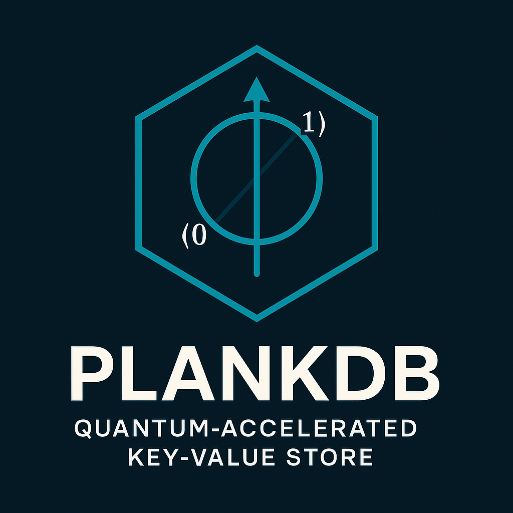

<table>
<tr>
  <td align="left" width="230">
    
  </td>
  <td align="left" valign="middle">
    <a href="https://github.com/qosf/awesome-quantum-software#quantum-tools">
      
    </a>
  </td>
</tr>
</table>

# PlankDB
**Quantum-Accelerated Key-Value Store**

## Table of Contents
1. [Introduction](#1-introduction)
2. [Project Overview](#2-project-overview)
3. [Run](#3-project-run)
4. [Architecture and Code Structure](#4-architecture-and-code-structure)
5. [Quantum Search Theory and Practice](#5-quantum-search-theory-and-practice)
6. [Limitations and Practical Considerations](#6-limitations-and-practical-considerations)
7. [License](#7-license)


---

## 1. Introduction

**PlankDB** is an experimental quantum key-value database (search-oriented) implemented in Java, featuring a REST API for user interaction.

The main highlight of PlankDB is the integration of Java code with quantum search. When a search request is performed, PlankDB may invoke the Grover algorithm on a quantum emulator or on real quantum hardware (via IBM Qiskit Runtime).

Conceptually, the `QuantumMap` object behaves like a regular `Map`, but during lookup operations it switches to quantum mode, reflecting the demonstration purpose of the project.

Although PlankDB implements the `Map<Key, Value>` interface, the underlying search is not hash-based. This is not a true hash map, but rather an abstract unsorted collection, over which quantum selection is applied.

### 📊 Search Complexity Comparison

| 🧠 Search Method           | ⏱️ Average Complexity |
|---------------------------|------------------------|
| `HashMap` (key-based)     | **O(1)**               |
| Classical linear search   | **O(n)**               |
| Quantum search (Grover)   | **O(√n)**              |

Thus, PlankDB demonstrates the properties and limitations of applying Grover's quantum search algorithm to unstructured data.

Additionally, PlankDB showcases how classical programming environments (such as Java) may interact with quantum computing systems. In the near future, we may expect a variety of integration scenarios:

- Invoking quantum workloads through REST APIs in the cloud (as in this project);
- Direct connections to on-premises quantum hardware;
- Embedding provider-specific SDKs into mainstream languages (including JVM-based languages);
- Transparent switching to quantum mode triggered by data scale or query complexity.

PlankDB represents a prototype for what practical quantum search integration could look like, and it provides a starting point for the broader discussion about future standards of interoperability between classical and quantum computing platforms.

## 2. Project Overview

PlankDB is intended to be launched and tested via **Docker**. Although local builds are technically possible, the project has only been fully tested within Docker containers.

### 🔧 Quick Start with Docker

```bash
git clone https://github.com/swampus/plank-db.git
cd plank-db

docker compose build
docker compose up
```

This will launch the service and expose the API on port `8080`.

> 🔁 Alternatively, you can also use classic Docker CLI:
>
```bash
docker build -t plankdb .
docker run -p 8080:8080 plankdb
```

### 🗂️ Repository Structure

- `web/` – Spring Boot REST API layer
- `application/` – business logic layer
- `domain/` – core interfaces and models
- `infrastructure/` – integration services and runners
- `python/` – Python scripts for both local simulation and IBM Quantum execution
    - `grover.py`, `grover_range.py` – for local backend
    - `grover_ibm.py`, `grover_range_ibm.py` – for IBM Quantum

### 💡 Local Usage (not officially tested)

To run PlankDB locally:
- Ensure you have Java 17+ and Python 3.10+ installed
- Install [Qiskit](https://qiskit.org/documentation/getting_started.html) in a virtual environment
- Run backend scripts from `scripts/` folder manually if needed
- Edit `application.yml` for local configuration
- Launch via `mvn spring-boot:run`

**Note**: Quantum integration is triggered through subprocess-based execution of Qiskit scripts, and may require additional setup.

### 🌐 Cloud Execution (IBM Qiskit Runtime)

PlankDB supports execution on IBM's real quantum devices via [IBM Quantum Runtime](https://quantum.ibm.com/lab). To use this mode:

1. Register at: https://quantum.ibm.com
2. Generate your API token in your [account settings](https://quantum.ibm.com/account)
3. Enable billing with a credit card (for real-device access)
4. Set the following environment variables (or use the provided `.env` file):

```bash
export QUANTUM_EXECUTION_MODE=IBM
export QUANTUM_IBM_TOKEN=your_ibm_token
```

These variables allow switching between local simulation and IBM Quantum cloud execution. The values will be used automatically if placed in a `.env` file in the project root.

### 🔗 REST API and Swagger UI

PlankDB exposes a RESTful HTTP API available on port `8080`.  
For full interactive documentation and testing, use the Swagger UI:

➡️ [http://localhost:8080/swagger-ui.html](http://localhost:8080/swagger-ui.html)

Key endpoints include:

- `POST /collections/{collection}/put` — insert a key-value pair
- `GET /collections/{collection}/search/{key}` — perform **Grover-based quantum search**h**

Each endpoint is documented in the Swagger UI, including:
- request/response examples
- quantum-specific result fields like `confidence_score` or `execution_time_ms`
- descriptions of fallback behavior if quantum execution is unavailable

This API is suitable for both classical usage and quantum-enabled applications.

## 3. Project Run

### 🛠 Requirements

To build and run PlankDB locally, you need the following installed:

- [Java 17](https://adoptium.net/)
- [Apache Maven](https://maven.apache.org/) – used for project compilation
- (Optional) [`make`](https://www.gnu.org/software/make/) – used as a shortcut for build commands

> **Note**: `make build` is a wrapper for `mvn clean install -DskipTests`. Maven is required in both cases.

---

### 🐳 Recommended: Run via Docker Compose

PlankDB is designed to run smoothly with **Docker Desktop** and `docker compose`.

To get started:

```bash
docker compose up --build
```

> ⚠️ **Java 17 is required** — newer versions (e.g. Java 21) are not compatible due to API changes.

Once running, the API will be available at:  
👉 http://localhost:8080/swagger-ui/index.html

For consistent behavior across platforms, we **highly recommend using** [Docker Desktop](https://www.docker.com/products/docker-desktop/) — it's free for personal and small business use.

> 🔁 **Note**: On the first attempt, `docker compose up --build` may fail due to Qiskit or network dependency issues.  
> Simply rerunning the command usually resolves it.

---

### 💡 Local Usage (Not Officially Supported)

Local setup is possible but **not officially supported or guaranteed to work reliably**, due to differences in operating systems, Python environments, and quantum library configurations.

However, for users who wish to run PlankDB outside of Docker, here are the recommended steps:

#### 🔧 Step-by-step instructions:

1. **Install Java 17**
    - Recommended via [Adoptium](https://adoptium.net/)
    - Verify with: `java -version`

2. **Install Apache Maven**
    - Official site: [https://maven.apache.org](https://maven.apache.org)
    - Verify with: `mvn -version`

3. **Clone the repository**
   ```bash
   git clone https://github.com/swampus/plank-db.git
   cd plank-db
   ```

4. **Build the project using Maven**
   ```bash
   mvn clean package
   ```

5. **Run the application**
   ```bash
   java -jar target/plank-db-*.jar
   ```

#### 🧪 Quantum Execution Requirements (Optional but needed for full features)

To enable Grover-based quantum search locally:

6. **Install Python 3.10+ and create a virtual environment**
   ```bash
   python -m venv .venv
   source .venv/bin/activate  # or .venv\Scripts\activate on Windows
   ```

7. **Install Qiskit and dependencies**
   ```bash
   pip install -r python/requirements.txt
   ```

8. **Set environment variables**
    - Either export manually or create a `.env` file in the root folder:
      ```env
      QUANTUM_EXECUTION_MODE=LOCAL
      ```

9. **Configure application settings**
    - Edit `src/main/resources/application.yml` if needed for backend paths or collection settings.

> ⚠️ Note: On some systems, Python subprocess handling or Qiskit versions may cause errors.
> This mode is best suited for development, debugging, or integration experimentation.

**For most users, Docker remains the strongly preferred method for stability and reproducibility.**

## 4. Architecture and Code Structure

PlankDB follows the principles of **Clean Architecture**, promoting clear separation of concerns and independence between layers. This structure improves testability, modularity, and long-term maintainability — essential qualities for both experimental and production-grade systems.

### 🧱 Package Structure Overview

The project is organized into the following core packages:

- `domain/`  
  Defines core domain interfaces and abstract models.  
  It is independent of frameworks and contains no external dependencies.

- `application/`  
  Contains use cases that encapsulate the business logic of the system.  
  These use cases coordinate domain interfaces and serve as the heart of the application logic.

- `infrastructure/`  
  Implements interaction with external systems such as Python quantum scripts, file runners, and environment configuration.  
  This layer acts as the adapter between the core logic and the outside world.

- `web/`  
  Provides the REST API using Spring Boot.  
  It exposes endpoints for interacting with collections, performing quantum and range queries, and integrates with the application layer via dependency injection.

- `python/`  
  Contains executable Python scripts that implement Grover’s algorithm for both local and IBM Quantum backends.  
  These scripts are invoked by the infrastructure layer and return quantum search results back to the application.

### 🧩 Why Clean Architecture?

This approach is chosen because it:

- Enables isolated testing of logic without reliance on HTTP or Python dependencies
- Makes it easy to swap or extend quantum execution backends (e.g., simulator vs. real hardware)
- Encourages long-term separation of interface and implementation
- Supports both demonstration and research-level experimentation

The modular layout ensures that PlankDB remains flexible and maintainable, even as quantum technologies evolve.

### 🧠 Dependency Inversion in Practice

PlankDB adheres to the **Dependency Inversion Principle (DIP)** — a core part of Clean Architecture — by organizing dependencies around abstractions:

- The `application/` and `domain/` layers depend only on interfaces, never on concrete implementations.
- Quantum execution interfaces are declared in the domain layer, while real implementations (e.g. Python script runners) reside in `infrastructure/`.
- The REST API in `web/` interacts only with the application layer, unaware of how quantum execution is actually performed.

This design makes it easy to:
- Swap quantum backends (e.g., switch from local simulation to IBM hardware)
- Test the application logic in isolation (using mocks or stubs)
- Maintain long-term separation between business logic and technical concerns

By inverting dependencies and structuring around use cases, PlankDB remains flexible, extendable, and robust against changes in technology or platform.

## 5. Quantum Search Theory and Practice

<details>
<summary>📘 Expand subsections</summary>

- [5.1 Quantum Superposition: The Theoretical Basis](#51-quantum-superposition-the-theoretical-basis)
- [5.2 Grover's Algorithm Explained](#52-grovers-algorithm-explained)
- [5.3 How PlankDB Uses Grover](#53-how-plankdb-uses-grover)
- [5.4 Probabilistic Nature of Quantum Results](#54-probabilistic-nature-of-quantum-results)
- [5.5 When Will Quantum Search Matter?](#55-when-will-quantum-search-matter)
- [5.6 DTO Breakdown and References](#56-dto-breakdown-and-references)

</details>

---

### 5.1 Quantum Superposition: The Theoretical Basis

At the heart of quantum computing lies the concept of **superposition** — a fundamental difference from classical computation.

In classical systems, a bit can be either `0` or `1`.  
In quantum systems, a **qubit** can be in a **superposition** of both `|0⟩` and `|1⟩` states simultaneously:

```
|ψ⟩ = α|0⟩ + β|1⟩
```

Where:
- `α` and `β` are complex amplitudes,
- |α|² + |β|² = 1,
- The square of the amplitude gives the **probability** of observing that state upon measurement.

When you measure the qubit, the superposition collapses into either `0` or `1` — but until measurement, the system evolves as a combination of both.

In multi-qubit systems, superposition enables a system of `n` qubits to represent `2ⁿ` possible states **simultaneously**.  
This exponential parallelism is what makes quantum algorithms — like Grover’s — so powerful.

For example, with 5 qubits we can simultaneously explore 32 different states.

This is not parallel computing in the classical sense — rather, it’s a **probabilistic amplitude evolution** governed by linear algebra over Hilbert space.

In PlankDB, this principle is simulated by running Grover’s algorithm over a space of binary-encoded keys.  
Each possible key is mapped to a quantum state in superposition, and the oracle function is used to mark the correct state, increasing its measurement probability.

---

### 5.2 Grover's Algorithm Explained

Grover's algorithm allows searching an unsorted list of `N` items in approximately **√N** steps — a quadratic speedup over classical search.

Key steps:

1. **Initialization** — Create an equal superposition over all states
2. **Oracle** — Mark the correct state by inverting its amplitude
3. **Diffusion operator** — Reflect the state vector around the average
4. **Repeat** — Run this process √N times

The amplitude of the marked state increases with each iteration.  
After a few iterations, a measurement is likely to return the correct state.

This algorithm is implemented using Qiskit circuits — either locally (Aer simulator) or remotely (IBM Quantum Runtime).

---

### 5.3 How PlankDB Uses Grover

In PlankDB, both `search` and `range` operations rely on Grover's algorithm:

- A collection of keys is loaded into a Python script and encoded as binary
- An oracle circuit is constructed based on the key or range condition
- Grover's algorithm is run to amplify the matching state
- The result is decoded and returned to the Java API

This is not efficient for production — O(n) time to prepare the state — but is ideal for demonstration purposes.

---

### 5.4 Probabilistic Nature of Quantum Results

Quantum search results are inherently **probabilistic** — a correct answer is likely, but not guaranteed.

PlankDB returns a rich result object:

```json
{
  "quantum_result": {
    "matched_key": "0101",
    "matched_value": "example",
    "matched_index": 5,
    "top_measurement": "0101",
    "oracle_expression": "key == 0101",
    "num_qubits": 4,
    "confidence_score": 0.91,
    "execution_time_ms": 84,
    "oracle_depth": 8,
    "iterations": 3
  },
  "scientific_notes": {
    "principle": "Grover amplification",
    "theory": "oracle-based selection in Hilbert space",
    "circuit_behavior": "amplitude modulation",
    "confidence_interpretation": "non-deterministic probability outcome",
    "qubit_commentary": "n qubits encode 2^n states",
    "encoding_map": {
      "0000": "a",
      "0001": "b"
    },
    "used_iterations": 3
  }
}
```

This DTO (`QuantumResultDTO`) includes both raw results and scientific context for interpretability.

---

### 5.5 When Will Quantum Search Matter?

Grover's algorithm provides meaningful advantage when:

- The dataset is large (thousands to millions of records)
- Search is performed repeatedly over static data
- Quantum memory (QRAM) becomes practical

Today, these conditions are not met — data loading is classical and overhead is high.

However, PlankDB provides a useful demonstration of how such systems **could** work — and what real-world Java–quantum integration might eventually look like.

---

### 5.6 DTO Breakdown and References

#### 📘 QuantumResultDTO: Structure Explanation

| Field                    | Description |
|--------------------------|-------------|
| `matched_key`            | The key found by quantum search (in binary or text form) |
| `matched_value`          | The value associated with that key |
| `matched_index`          | Index in the list of all inputs |
| `top_measurement`        | Most frequently observed measurement state |
| `oracle_expression`      | Oracle logic used in Grover (e.g., `"key == 1010"`) |
| `num_qubits`             | Number of qubits used for the search |
| `confidence_score`       | Probability of correctness (0.0 – 1.0) |
| `execution_time_ms`      | Time spent in script execution |
| `oracle_depth`           | Logical circuit depth of the oracle |
| `iterations`             | Number of Grover iterations performed |

And:

| Field (`scientific_notes`)   | Description |
|------------------------------|-------------|
| `principle`                  | Algorithmic principle (e.g., Grover amplification) |
| `theory`                     | Scientific explanation (e.g., amplitude evolution) |
| `circuit_behavior`           | Summary of what the circuit does |
| `confidence_interpretation`  | Notes on how to interpret probabilistic output |
| `qubit_commentary`           | Explanation of how the number of qubits relates to space |
| `encoding_map`               | Mapping of binary strings to original keys |
| `used_iterations`            | How many iterations were used in this run |

---

#### 🧠 Visualizing the Grover Circuit

```
q_0: ———H———●————X———H———M
             |        |
q_1: ———H———●————X———H———M
        Oracle   Diffusion
```

- H: Hadamard gate (superposition)
- ●: Controlled oracle marking
- X + H: Inversion around average (diffusion)
- M: Measurement

---

#### 📚 References and Scientific Background

- Grover, L. K. (1996). *A fast quantum mechanical algorithm for database search*.  
  ➡️ https://arxiv.org/abs/quant-ph/9605043
- Nielsen & Chuang. *Quantum Computation and Quantum Information*
- Qiskit Grover API: https://qiskit.org/documentation/stubs/qiskit.algorithms.Grover.html
- IBM Quantum Runtime: https://docs.quantum.ibm.com/run


## 6. Limitations and Practical Considerations

While PlankDB demonstrates the principles of quantum search in a practical Java-based application, it is subject to several real-world limitations that must be considered.

### 🚧 Not Production-Ready
- PlankDB is a **prototype** — designed for learning, demonstration, and experimentation
- The system is **not optimized for performance or concurrency**
- It does **not persist data** beyond runtime (in-memory only)
- No authentication, rate limiting, or production deployment support is included

### 🐌 Classical Bottlenecks
Although Grover’s algorithm runs in `O(√n)` time, preparing the data for quantum execution still requires:
- **O(n)** time to load the collection into memory
- Binary encoding and serialization of keys to pass to the Python script
- Subprocess overhead for spawning Python (especially on Windows)
  These factors **negate the quantum speedup** for small or medium-sized datasets.

### 🧠 Quantum Hardware Constraints
- IBM Quantum has **limited availability**, even with billing
- Circuit depth, qubit decoherence, and queue time significantly affect results
- Noise can corrupt outputs unless error mitigation is applied
  For these reasons, PlankDB primarily runs on **local simulation (Qiskit Aer)** during development.

### 🔬 Probabilistic Output and Confidence
Quantum results are **non-deterministic**:
- A query may return the wrong key with small probability
- PlankDB includes a `confidence_score` field to represent the likelihood of correctness
- Repeated runs improve reliability but increase cost on real quantum hardware

### 📊 Search Suitability Criteria

Grover's search is ideal when:

| Factor                          | Classical Search | Quantum Grover |
|---------------------------------|------------------|----------------|
| Large datasets (n > 10,000)     | ❌ Slower        | ✅ Scales better |
| Small collections               | ✅ Fast          | ❌ Overhead too high |
| Multiple queries on static data | ❌ Repeated scans| ✅ Amortized |
| Fast answer required            | ✅ Deterministic | ❌ Probabilistic |

### 🧭 Future Outlook
As quantum hardware matures and **QRAM** becomes available, systems like PlankDB could:
- Eliminate the O(n) classical loading bottleneck
- Perform batch queries and filtering entirely in quantum space
- Integrate deeper with Java or Kotlin through native quantum SDKs

Until then, PlankDB remains a valuable **educational and architectural prototype** for quantum-enhanced search systems.

## 7. License

This project is licensed under the **MIT License** — a permissive open-source license.

You are free to use, modify, and distribute the code for both commercial and non-commercial purposes, provided that the original copyright notice is included.

📘 Full license text is available at:  
➡️ [LICENSE](https://github.com/swampus/plank-db/blob/development/LICENSE)


## 🤝 Contributing

Contributions, issues, and feature requests are welcome!

If you’d like to help improve PlankDB:

1. Fork the repository
2. Create a new branch
   ```bash
   git checkout -b feature/your-feature
